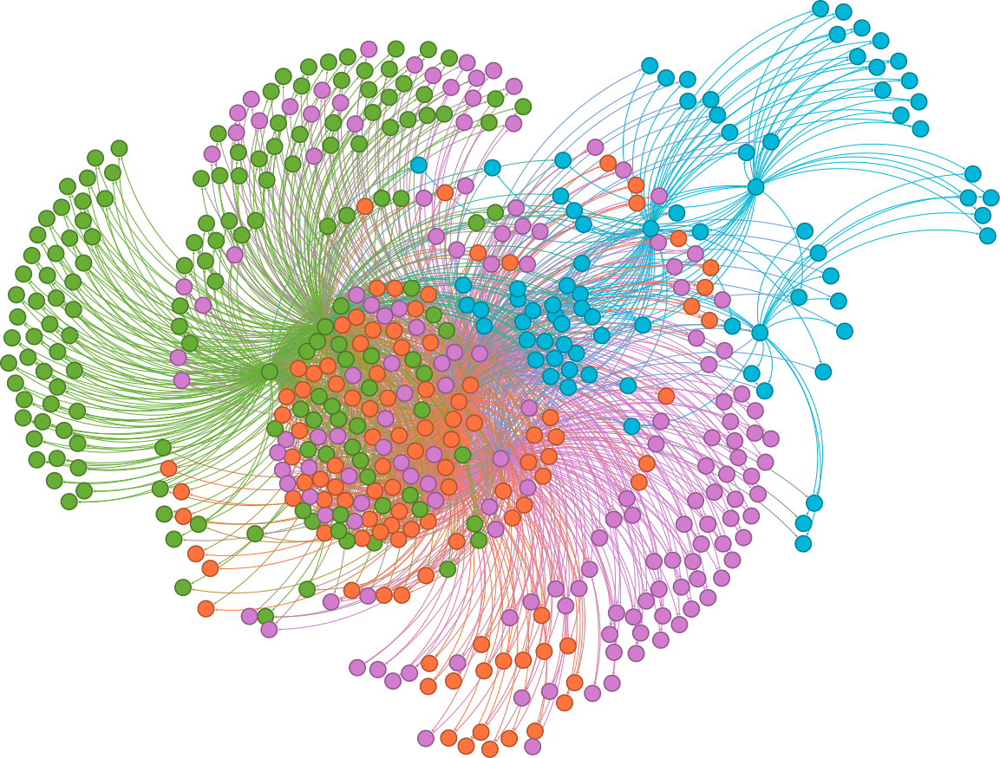

# AED2 - Rede paginas do Wikipedia
Este é um repositorio dedicado a apresentar o conteúdo apresentado um trabalho desenvolvido no curso Algoritimos e Estrutura de Dados II da Universidade Federal do Rio Grande do Norte.
No trabalho havia os seguintes requisitos:
- Requisito #01: Gerar uma rede (grafo) dirigida a partir dos links de três páginas iniciais da Wikipedia (SEEDs), com profundidade limitada a 2.
- Requisito #02: Criar uma visualização da rede no Gephi, destacando as diferenças de cores nos vértices, com explicações.
- Requisito #03: Gerar uma figura da rede destacando o in-degree dos vértices, acompanhada de descrições.
- Requisito #04: Visualizar a rede no Gephi destacando k-core e k-shell, com vértices dimensionados pelo in-degree, e fornecer uma explicação.
- Requisito #05: Produzir a rede com as cores das comunidades e tamanho dos vértices baseado no in-degree.

# Implementação
### Requisito 1:

- **Criação das 3 Seeds:**
  - Seeds foram criadas para as páginas do Wikipedia de São José do Campestre, Medium, e Santana do Seridó.
  
- **Atualização das Stop Pages:**
  - As páginas de parada foram atualizadas para as mais populares, garantindo que a análise foque em páginas mais relevantes.
  
- **Criação dos Grafos:**
  - Foram criados três grafos distintos: São José do Campestre, Medium e Santana do Seridó.

### Requisito 2:

*Medium:*
### 
Nesta imagem, utilizei a estratégia do Eigenvector Centrality porque ela é eficaz para destacar os nós mais relevantes e influentes na rede. Os dados são diferenciados por cor e tamanho:

- **Tamanho dos Nós:** Indica a influência do nó, ou seja, se ele é mais ou menos importante com base nos vizinhos dos seus vizinhos.
- **Cor dos Nós:** Reflete a centralidade dos nós, indicando a quantidade de conexões que cada nó possui.

Observa-se que, embora o nó correspondente ao Medium seja central, ele tem vizinhos que são ainda mais influentes do que ele.

*Santana do seridó:*
### 
Aqui, usei a métrica de Closeness Centrality porque ela permite identificar quais nós estão mais próximos dos outros na rede, ou seja, quais páginas são mais acessíveis dentro do contexto de Santana no Wikipedia.

*São José do Campestre:*

### 
Neste grafo, também utilizei a métrica de Closeness Centrality. Assim como no grafo de Santana, os nós têm tamanhos aproximadamente iguais, o que indica que a influência entre eles é similar. No entanto, ao observar as cores, é possível ver que alguns nós são significativamente mais centrais, destacando-se como os principais na rede.

### Requisito 3:

 
### São José do Campestre:
 **Eixo Y (Count):** Mostra a quantidade de nós (páginas) que têm um determinado grau.
**Eixo X (Degree):** Representa o número de conexões (arestas) que cada nó (página) tem com outros nós.
### 
#### Histograma do Grau (Degree Histogram):

No primeiro gráfico Histograma do Grau é visível que a grande maioria das páginas tem um grau muito baixo, próximos a zero. Isso sugere que a maioria das páginas relacionadas à página central de São José do Campestre possui poucas conexões, indicando que estas páginas não têm muitas ligações para outras páginas dentro desse subgrafo específico.

#### Histograma com Zoom (Degree Histogram - Zoom):

Este gráfico Histograma com Zoom é uma ampliação dos primeiros 10 graus do histograma original. Aqui vemos que a maioria dos nós tem grau 1 ou 2, mas ainda há alguns com graus mais elevados (até 10). Apesar disso ainda existem algumas poucas páginas que estão conectadas a várias outras.

### Santana do Seridó:
### 
#### Histograma de Grau (Degree Histogram):

A maioria dos nós tem grau muito baixo, com quase todos concentrados entre 0 e 100 graus. Isso sugere que a maioria das páginas no grafo possui poucas conexões, sendo páginas mais isoladas ou com menor interconectividade.

#### Histograma com Zoom (Degree Histogram - Zoom):

Esse zoom mostra que mesmo dentro dos graus baixos (0 a 10), existe uma variação significativa, com alguns nós tendo apenas uma ou duas conexões e outros tendo até 10 conexões. No entanto, a maior concentração está nos nós com graus muito baixos, como 2 ou 3, indicando que a maioria das páginas está conectada a poucas outras.

A concentração de nós com graus baixos (no intervalo de 0 a 10) mostra que a maioria das páginas não são altamente conectadas. Elas estão, em sua maioria, isoladas ou conectadas a poucas outras páginas. Isso sugere uma estrutura descentralizada com alguns nós centrais ou hubs.

### Medium:
### 
#### Histograma de Grau (Degree Histogram) - Esquerda:

Quase todos os nós têm graus muito baixos, com uma alta concentração em nós com graus próximos a 0. Isso sugere que a maioria das páginas é altamente isolada ou conectada a pouquíssimas outras páginas.

#### Histograma com Zoom (Degree Histogram - Zoom):

O zoom revela uma variação nos graus baixos (0 a 10), com alguns nós tendo apenas 1 ou 2 conexões, e outros alcançando até 10 conexões. A maior concentração está nos nós com graus muito baixos, especialmente em torno de 2, indicando que a maioria das páginas está conectada a poucas outras.

### Requisito 4:

O k-core é um subgrafo em que todos os nós têm pelo menos k conexões, enquanto o k-shell é a camada que contém nós que foram removidos em um processo iterativo de remoção de nós com menos de k conexões.

### São José do Campestre:
### 
- **k-core:** 40 (amarelo)
- **k-shell:** 39 (vermelho)

A visualização da rede para São José do Campestre mostra uma estrutura bem cheia, com um k-core central de 40, indicando um núcleo denso de nós fortemente conectados. Os nós no k-shell de 39 estão um nível abaixo, representando as camadas periféricas da rede.

### Santana do Seridó:
### 
- **k-core:** 9 (amarelo)
- **k-shell:** 7 (vermelho)

Em comparação, o grafo de Santana do Seridó apresenta uma estrutura menos densa, com um k-core de 9. Isso indica que a rede tem um núcleo central menos conectado, com a camada k-shell de 7 representando uma periferia mais esparsa.

### Medium:
### 

- **k-core:** 11 (amarelo)
- **k-shell:** 10 (vermelho)

O grafo da rede Medium tem um k-core de 11, sugerindo uma estrutura intermediária em termos de conectividade, com um k-shell de 10 logo abaixo, indicando uma rede com um núcleo relativamente forte, mas com uma distribuição de conexões menos densa em comparação com São José do Campestre.

### Requisito 5:

A identificação de comunidades dentro de um grafo é essencial para entender como os nós se agrupam em subestruturas coesas, que podem representar grupos de interesse, tópicos ou clusters temáticos.

### 

- São José do Campestre: A rede foi dividida em 6 comunidades distintas. Cada comunidade foi colorida para facilitar a visualização das inter-relações dentro do grafo. As cores destacam as áreas onde os nós têm conexões mais densas, revelando a segmentação natural da rede.

### 

- Santana do Seridó: Foram identificadas 4 comunidades na rede. Essas comunidades mostram uma segmentação mais simples, com menos divisões internas, refletindo uma rede mais pequena ou menos complexa.

### 

- Medium: A análise revelou 11 comunidades distintas. A maior quantidade de comunidades sugere uma rede com uma estrutura temática rica e diversificada, onde diferentes tópicos ou grupos de interesse estão claramente delineados.
